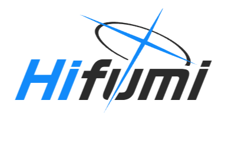

[](https://docs.rs/hifumi)


## Introduction

A serialization library for migrating data between different versions.

The name `hifumi` comes from the character [Hifumi](https://bluearchive.wiki/wiki/hifumi) in the game [Blue Archive](https://bluearchive.jp/).

> Still in development, the API may change in the future.

## Quick Start

```rust
use hifumi::version;

#[version("0.2")]
#[derive(Debug, Clone, PartialEq)]
#[migration("0.1" => "0.2" {
    + (c: i32, d: i32) => e: String { (c + d).to_string() },
    - f: f32,
})]
struct Test {
    a: i32,
    b: i32,
    c: i32,
    d: i32,
    e: String,
}
```
